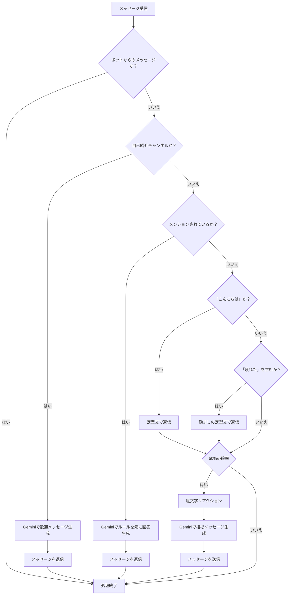

```mermaid
graph TD
    A[メッセージ受信] --> B{ボットからのメッセージか？};
    B -- はい --> C[処理終了];
    B -- いいえ --> D{自己紹介チャンネルか？};
    D -- はい --> E[Geminiで歓迎メッセージ生成];
    E --> F[メッセージを返信];
    F --> C;
    D -- いいえ --> G{メンションされているか？};
    G -- はい --> H[Geminiでルールを元に回答生成];
    H --> I[メッセージを返信];
    I --> C;
    G -- いいえ --> J{「こんにちは」か？};
    J -- はい --> K[定型文で返信];
    J -- いいえ --> L{「疲れた」を含むか？};
    L -- はい --> M[励ましの定型文で返信];
    L -- いいえ --> N{50%の確率};
    K --> N;
    M --> N;
    N -- はい --> O[絵文字リアクション];
    O --> P[Geminiで相槌メッセージ生成];
    P --> Q[メッセージを送信];
    Q --> C;
    N -- いいえ --> C;
```