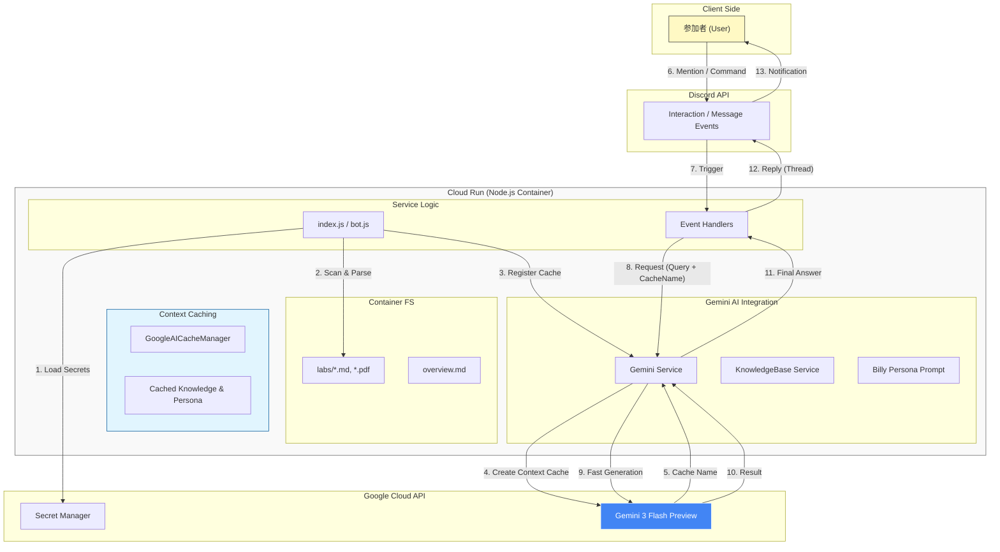

# ビリー隊長: 雅なるハンズオンサポート Discord Bot

> 「共に高みを目指そうぞ！🌸」 --- 重力から解放された熱き指導。

## 🌙 概要

**ビリー隊長**は、ハンズオンセミナーの参加者を雅に、かつ熱くサポートするために生まれた AI アシスタントです。Google Cloud の最新鋭モデル **Gemini 3 Flash Preview** と **Context Caching** 技術を駆使し、膨大な資料から瞬時に正解を導き出します。

---

## 🏛️ システムアーキテクチャ

Google Cloud Run 上で動作し、**Context Caching** を活用してナレッジベースを効率的に管理します。質問のたびに資料を読み直す必要がなく、極めて高速な応答を実現しています。



---

## 💠 主な特長

### 1. 瞬速の Context Caching
Gemini 1.5/3 の **Context Caching** を導入。32kトークンを超える大規模なハンズオン資料も、一度キャッシュすれば次回以降は爆速で回答します。

### 2. 雅なる「ビリースタイル」
「熱血」と「和」が融合した独自のペルソナ。参加者を励まし、共に歩む姿勢を崩しません。

### 3. マルチモーダル・ナレッジ
`labs/` 内の Markdown, Text はもちろん、**PDF** も自動でパースして知識として取り込みます。

---

## 🛠️ スラッシュコマンド

| コマンド | 内容 |
|----------|------|
| `"/config"` | 動作モードを雅に調整（メンション、ウェルカム、相槌など） |
| `"/status"` | キャッシュ状態やナレッジベースの統計を表示 |

---

## 🚀 はじめかた

### 1. 水（依存関係）を引く
```bash
npm install
```

### 2. 言の葉（環境変数）を綴る
`.env` に `GEMINI_API_KEY`, `DISCORD_BOT_TOKEN`, `GEMINI_MODEL=gemini-3-flash-preview` を設定。

### 3. 開陣（起動）
```bash
npm run deploy  # コマンド登録
npm start       # 出陣！
```

---

*Presented with Miyabi Passion by Sunwood AI Labs*
